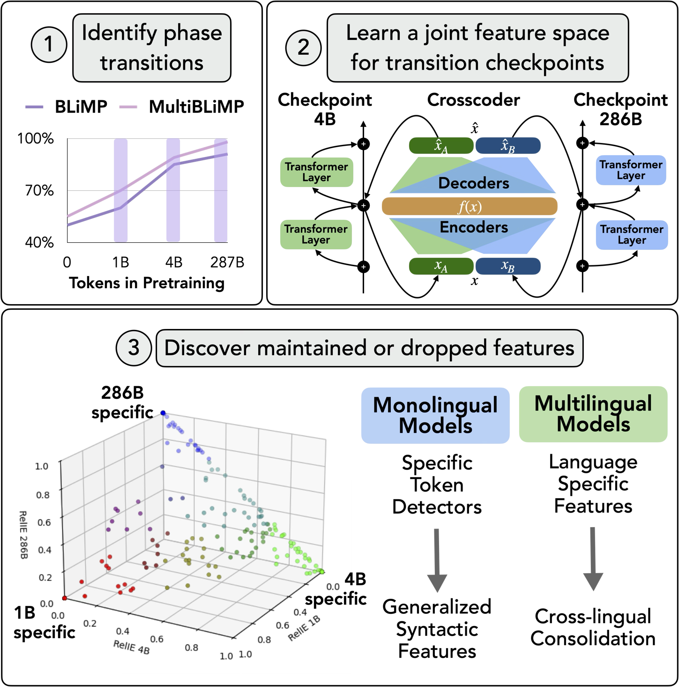

# Crosscoding Through Time: Tracking Emergence & Consolidation Of Linguistic Representations Throughout LLM Pretraining

This codebase is the implementation of the paper *"Crosscoding Through Time: Tracking Emergence & Consolidation Of Linguistic Representations Throughout LLM Pretraining"*. 

**Paper:** [https://arxiv.org/abs/2509.05291](https://arxiv.org/abs/2509.05291)

<p align="center">
    
    <br>
    <em>Figure 1: Capturing the evolution of features with crosscoders.</em>
</p>

> Given a task, our pipeline selects the relevant checkpoints during pretraining, learns a joint feature space with crosscoders, and then analyzes feature differences across checkpoints. This allows to analyze how models learn, maintain, or unlearn particular representations over time.

## Table of Contents

* [Abstract](#abstract)
* [Setup](#setup)
    * [Requirements](#requirements)
    * [Data & Checkpoints](#data--checkpoints)
* [Repository Structure](#repository-structure)
* [Usage](#usage)
    * [Activation & Accuracy Analysis](#activation--accuracy-analysis)
    * [Crosscoder Training & Evaluation](#crosscoder-training--evaluation)
    * [Attribution with RelIE](#attribution-with-relie)
    * [Annotation](#annotation)
    * [Ablation](#ablation)
* [Bugs or Questions](#bugs-or-questions)
* [Related Codebases](#related-codebases)
* [Citation](#citation)

## Abstract

Large language models (LLMs) learn non-trivial abstractions during pretraining, like detecting irregular plural noun subjects. However, it is not well understood when and how specific linguistic abilities emerge as traditional evaluation methods such as benchmarking fail to reveal how models acquire concepts and capabilities. To bridge this gap and better understand model training at the concept level, we use sparse crosscoders to discover and align features across model checkpoints. Using this approach, we track the evolution of linguistic features during pretraining. We train crosscoders between open-sourced checkpoint triplets with significant performance and representation shifts, and introduce a novel metric, Relative Indirect Effects (RelIE), to trace training stages at which individual features become causally important for task performance. We show that crosscoders can detect feature emergence, maintenance, and discontinuation during pretraining. Our approach is architecture-agnostic and scalable, offering a promising path toward more interpretable and fine-grained analysis of representation learning throughout pretraining.

## Setup

### Requirements

To run our code, you will need Python 3.10.12. In particular, we use a docker environment with `FROM --platform=linux/amd64 nvidia/cuda:12.0.0-devel-ubuntu22.04` on a node with 1 x NVIDIA A100 80GB GPU. You can install the requirements as follows:

```shell
# cd into the repo first
conda create -n diffvenv python=3.10.12
conda activate diffvenv
pip install -r requirements.txt
pip install --upgrade notebook
pip install --upgrade nbformat
git submodule update --init --recursive sae_vis
cd sae_vis
pip install -e .
cd ..
pip uninstall -y torch torchvision torchaudio
pip install torch torchvision torchaudio --extra-index-url https://download.pytorch.org/whl/cu12.4
```

Our code uses `wandb` to log the experiment metrics. So make sure to login with your API key or have the key in your OS environment. 

### Data & Checkpoints

Due to its small size, some of the data is directly uploaded to the repository in the `data` folder. The others will need to be downloaded and cached into `workspace/cache` by running the following script:

```shell
python scripts/download_lmodeling_data.py
```

You can also download our already trained crosscoders with the following scripts:

```shell
# TODO: script not complete
bash scripts/download_crosscoders.sh
```

## Repository Structure

The repository is structured the following way with the caching and results logging happening in a folder called `workspace`.

```shell
│ # ---------------- folders ----------------
├── data # SV agreement datasets
│   ├── blimp_data
│   └── clams_data
├── sae_vis # repository for feature activation visualization added as a submodule
├── scripts # scripts folder
├── workspace # caching/logging folder, ignored in .gitignore
│   ├── act_cache # caching for model activation on particular datasets
│   ├── cache # caching for LModeling and MultiBLiMP datasets
│   ├── logs # crosscoder logs for checkpointing + evaluation
│   ├── results # accuracy, sparsity, and CE results, a space to aggregate res
│   └── tensor_data # the .pt version of the lmodeling datasets
│ # ---------------- notebooks ----------------
├── analysis_acc_activ.ipynb # plots for accuracy and activation
├── analysis_figs_tables.ipynb # remaining plots & tables for the paper
├── analysis_sparsity_ce.ipynb # tables for sparsity and CE diff tables
├── analysis_get_exper_version_num.ipynb # retrieves experiment IDs matching given hyperparam criteria
│ # ---------------- python files ----------------
├── attribution.py # crosscoder feature attribution script
├── buffer.py # activation buffering class
├── constants.py # !!! TODO: artifact that will be deleted !!!
├── crosscoder.py # crosscoder class
├── LICENSE
├── README.md
├── requirements.txt
├── test_crosscoder_revision.py # crosscoder evaluation script
├── train_crosscoder_revision.py # crosscoder training script
├── trainer.py # trainer class
├── utils.py # utility functions
└── vis.py # visualization functions
```

## Usage

### Activation & Accuracy Analysis

If you would like to quickly find which revisions are available for a given huggingface `model_name` feel free to use our `scripts/model_get_revisions_available.ipynb`. Before running the notebook `analysis_acc_activ.ipynb`, we save the performance and activation of the models with the following scripts:

```shell
bash scripts/local_lm_harness_pythia_outer.sh
bash scripts/local_lm_harness_olmo_outer.sh
bash scripts/local_lm_harness_bloom_clams_outer.sh
python scripts/model_bloom_multiblimp_acc.py

bash scripts/model_get_activations.py --model_name="EleutherAI/pythia-1b" --task_name="subjectverb" --layer_num=8
bash scripts/model_get_activations.py --model_name="allenai/OLMo-1B-0724-hf" --task_name="subjectverb"  --layer_num=8
bash scripts/model_get_activations.py --model_name="bigscience/bloom-1b1-intermediate" --task_name="multiblimp_all_all"  --layer_num=12
```

Then for the visualization, run the `analysis_acc_activ.ipynb` notebook.

### Crosscoder Training & Evaluation

To train the crosscoders we use the following scripts:

```shell
bash scripts/local_train_l1_pythia.sh
bash scripts/local_train_l1_olmo.sh
bash scripts/local_train_l1_bloom.sh
```

For evaluation you can run the following scripts if you use our already trained crosscoders. If not, make sure to change the `version_list` variable:

```shell
bash scripts/local_eval_l1_pythia.sh
bash scripts/local_eval_l1_olmo.sh
bash scripts/local_eval_l1_bloom.sh
```

And then gather the results as shown in `analysis_sparsity_ce.ipynb`.
If you train your own crosscoder, and would like to quickly find the version number of those that have certain hyperparameters values, feel free to use the `analysis_get_exper_version_num.ipynb` notebook.

### Attribution with RelIE

To compute the IE and RelIE values of crosscoders on particular datasets we use the following scripts:

```shell
bash scripts/local_ie_pythia.sh
bash scripts/local_ie_olmo.sh
bash scripts/local_ie_bloom_clams.sh
bash scripts/local_ie_bloom_multiblimp_perlang.sh
```

We then plot the results in `analysis_figs_tables.ipynb`.

### Annotation

For the annotation, run the scripts for attribution mentioned above, but set `--serve_html=True` or locate the HTML you desire in workspace and download it to open it in a browser. The HTML and CSV file to be annotated for the files will be located in the following path:

```python
version_number # this variable is the ID number of your experiment within workspace/logs/checkpoints
path_to_version = f"workspace/logs/ie_dicts_zeroshot/version_{version_number}/"
path_to_html = path_to_version + f"latents_{task}_ckpt20_thresh0.1_n{max_examples}_topk{k}.csv"
path_to_csv = path_to_version + f"viz_{task}_ckpt20_thresh0.1_n{max_examples}_topk{k}.html"
```

We then make the table for annotation via a script in `analysis_figs_tables.ipynb`.

### Ablation

To run the ablation experiments presented in Tables 7, run the following scripts:

```shell
bash scripts/local_ablation_topk_pythia.sh
bash scripts/local_ablation_topk_olmo.sh
```

We then make the table for ablation via a script in `analysis_figs_tables.ipynb`.

## Bugs or Questions

Note that this codebase is purely for the purpose of research and scientific experiments. We expect unknown bugs or issues caused by different package versions. Moreover, the Batch TopK Crosscoder implementation has not been fully tested and therefore may not be as reliable as the L1 Sparsity Crosscoder. If you encounter any problems when using the code or want to report a bug, you can open an issue. Please try to specify the problem with details so we can help you better and quicker! If you have any questions related to the code or the paper, feel free to email the corresponding authors.

## Related Codebases

This work was built on top of prior work and open-sourced code, which we are very grateful for. We particularly thank the contributors of [ckkissane/crosscoder-model-diff-replication](https://github.com/ckkissane/crosscoder-model-diff-replication), [saprmarks/feature-circuits](https://github.com/saprmarks/feature-circuits), and [science-of-finetuning/crosscoder_learning](https://github.com/science-of-finetuning/crosscoder_learning).

## Citation

If you use our method in your work, please cite our paper:

```bibtex
@misc{bayazit2025crosscodingtime,
    title={Crosscoding Through Time: Tracking Emergence & Consolidation Of Linguistic Representations Throughout LLM Pretraining}, 
    author={Deniz Bayazit and Aaron Mueller and Antoine Bosselut},
    year={2025},
    eprint={2509.05291},
    archivePrefix={arXiv},
    primaryClass={cs.CL},
    url={https://arxiv.org/abs/2509.05291}, 
}
```
